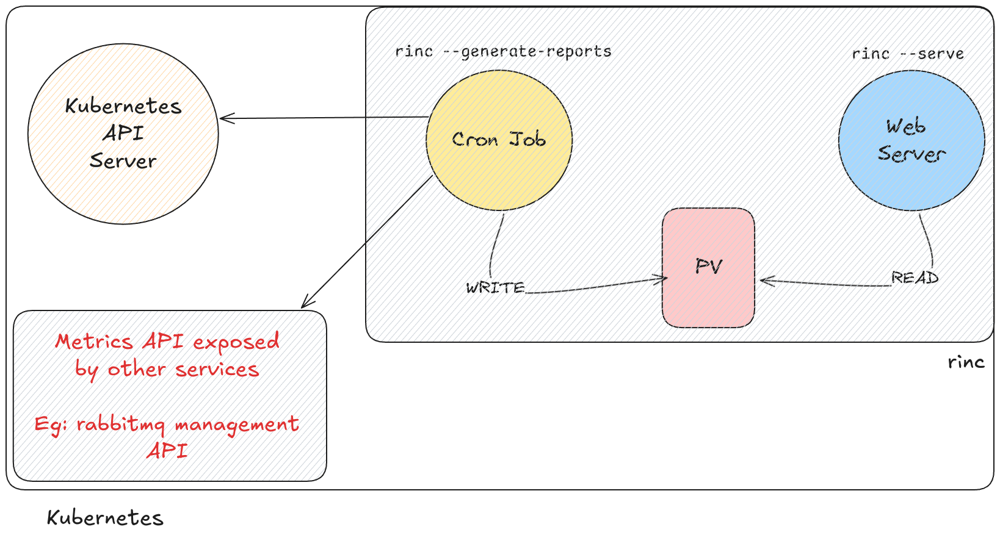

# RINC

## What is RINC?

RINC (short for "Reporting IN Cluster") is a simple and lightweight reporting tool that provides insights into the status of a Kubernetes cluster, as well as other services. It also supports alerting, where alerts can be defined using an expression language powered by the [gval](https://github.com/PaesslerAG/gval) Go library.

## Goals

1. Automate manual SRE tasks
2. Provide a centralized collection of useful metrics and reports
3. Offer an alerting system, powered by an expression language, to trigger warnings and critical issue notifications
4. Provide a simple and lightweight solution for on-prem clients to gain visibility into their clusters through reports

> Please note that RINC is still in its early stages of development and is **not** feature complete.

## Architecture



## Supported reports

* Kubernetes deployment and statefulset status reports
* Long-running job reports
* Kubernetes deployment and statefulset image tag reports
* RabbitMQ metrics reports
* CEPH metrics reports
* Pod status reports (*Work in Progress*)

Please refer to the provided [example configuration](./config.example.yaml) and [Helm chart](./helm/rinc/).

## Alerts

Alerts are at the heart of RINC. They are configured using an expression language powered by the [gval](https://github.com/PaesslerAG/gval) Go library.

### Example CEPH alert

Below is an example of a CEPH alert that triggers when one or more OSDs are not part of the data replication and recovery process:

```yaml
- message: OSDs are not part of the data replication and recovery process
  when: sumUint(Status.OSDMap.OSDs, "In") != len(Status.OSDMap.OSDs)
  severity: warning
```

### Breakdown of the alert structure

An alert consists of three parts:

1. **`message`**: The alert message that will be displayed.
2. **`severity`**: The severity level, which can be "info", "warning", or "critical".
3. **`when`**: A boolean expression (written in gval) that triggers the alert when it evaluates to `true`.

> This document assumes that you are familiar with the [gval](https://github.com/PaesslerAG/gval) documentation.

We extend gval with custom functions and operators to help you write alerts.

### Custom functions

#### `has`

Checks if y is contained within x.

Definition: `has(x: array|string, y: any|string)`

Parameters:

* x: Can be a string or array.
* y: The value to check for within x.

Returns: bool

#### `len`

Returns the length of x if it is a string, array or a hashmap.

Definition: `len(x: array|string)`

Parameters:

* x: Any supported type (string, array, map).

Returns: int

#### `fieldsEq`

Checks if all elements in list have a struct field field that equals a value.

Definition: `fieldsEq(list: array, field: string, value: any)`

Parameters:

* list: Array of structs.
* field: Name of the struct field to compare.
* value: The value to check for equality with each struct’s field.

Returns: bool

#### `findOne`, `findMany`, `findOneRegex`, `findManyRegex`

These functions search an array of structs for items with a field matching a specific value or regex.

Definition:

* `findOne(list: array, field: string, value: any)`
* `findMany(list: array, field: string, value: any)`
* `findOneRegex(list: array, field: string, value: stringRegex)`
* `findManyRegex(list: array, field: string, value: stringRegex)`

Parameters:

* list: Array of structs.
* field: The name of the struct field to search. In case of the regex functions, the property (name = `field`) must be of type string.
* value: The value to compare the field with. In case of the regex functions, `value` must be a regex string.

Returns:

* `findOne`: First matching item (or nil if no match).
* `findMany`: Array of all matching items.
* `findOneRegex`: First item with a field matching a regex.
* `findManyRegex`: All items with fields matching a regex.

#### `evalOnEach`

Evaluates an expression on each struct in list and returns a list of values for the `ret` field from items that satisfy the expression.

Definition: `evalOnEach(list: array, expr: string, ret: string)`

Parameters:

* list: Array of structs.
* expr: Boolean expression to evaluate on each struct.
* ret: Name of the field to retrieve from each item that satisfies the expression.

Returns: list of values from the `ret` field of items that pass the expression.

#### `sumT`

Where T can be `Int`, `Int8`, `Int16`, `Int32`, `Int64`, `Uint`, `Uint8`, `Uint16`, `Uint32`, `Uint64`, `Float32` & `Float64`.

Calculates the sum of a numeric field across all structs in the provided array.

Definition:

* `sumInt(list: array, field: string)`
* `sumInt8(list: array, field: string)`
* `sumInt16(list: array, field: string)`
* `sumInt32(list: array, field: string)`
* `sumInt64(list: array, field: string)`
* `sumUint(list: array, field: string)`
* `sumUint8(list: array, field: string)`
* `sumUint16(list: array, field: string)`
* `sumUint32(list: array, field: string)`
* `sumUint64(list: array, field: string)`
* `sumFloat32(list: array, field: string)`
* `sumFloat64(list: array, field: string)`

Parameters:

* list: Array of structs.
* field: Name of the numeric field to sum.

Returns: integer

### Custom operators

#### Access Operator (`->`)

Provides access to a field of a struct or each struct in an array.

Parameters:

* LHS: Struct or an array of structs.
* RHS: Field name as a string.

Returns: Value(s) of the field for struct(s) in x.

Example,

```
x = {
	foo: "bar",
	bar: "blah"
}

x -> foo // "bar"
x -> bar // "blah"
```

#### Pipe Operator (`|`)

Use to chain expressions. The result of the preceding expression is passed as input to the following expression.

Example,

```
{
	"x": findOneRegex(Deployments, "Name", "^metabase$")
} |
(x -> "ReadyReplicas") < (x -> "DesiredReplicas")
```

In the above example, a variable `x` is defined in the first half, and then used in the second half.

### Injecting expressions into the alert message

To inject the result of an expression into the message itself, surround the expression with backticks (``). Continuing with the CEPH OSDs example, suppose we want to include the number of OSDs that are **not** part of the data recovery and replication process.

```yaml
- message: |
    `sumUint(Status.OSDMap.OSDs, "In")` OSDs are not part of the data replication and recovery process.
  when: sumUint(Status.OSDMap.OSDs, "In") != len(Status.OSDMap.OSDs)
  severity: warning
```

It is important to use the multi-line YAML string syntax (`|`) for the YAML libraries to parse the input correctly.

## Exploring collected metrics

Understanding the expression language is important, but it's equally crucial to know what variables are available for use in your expressions. For example, to write an alert that triggers when one or more OSDs are not part of the data replication and recovery process, you need to know the relevant variable. In this case, the variable is `Status.OSDMap.OSDs`, which is an array of structs containing a property called `In`. The value of `In` is 1 when the OSD is part of the data replication and recovery process, and 0 otherwise.

Prometheus provides an interface where you can guess variable names, and it will try to autocomplete them for you. While RINC doesn't yet have such an interface, we provide a simpler solution:

While Prometheus stores data in a flat structure, RINC stores data in a JSON-like format. We expose this schema as a [JSON Schema](https://json-schema.org/). JSON Schema is an industry-standard format, and many tools are available to help you visualize it. For example, here is an example of a visual representation of the CEPH schema using [Atlassian's JSON Schema viewer](https://tinyurl.com/cephjsonschema).

To generate a schema for CEPH, for example, you can run:

```
rinc --generate-schema ceph
```

This schema can then be analyzed in your preferred tool.
